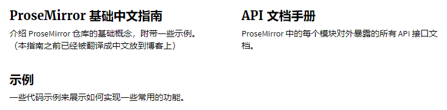

# Tiptap（by Prosemirror）

## Prosemirror
[英文官网](https://prosemirror.net/)

[中文官网](https://prosemirror.xheldon.com/)

主要学习了中文指南和基础示例，详细 API 与高级示例待用到时再看：

## Tiptap
#### document（搭配 Prosemirror 很好理解）
#### examples
[Interactivity（NodeView）](https://tiptap.dev/examples/interactivity)

[Syntax highlighting（NodeView with lowlight）](https://tiptap.dev/examples/syntax-highlighting)

