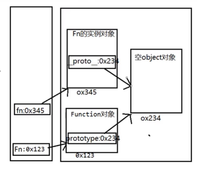
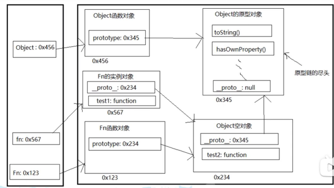
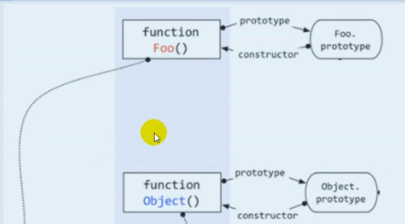
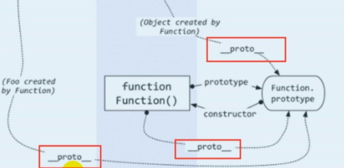

# 原型与原型链

[**从引用类型的四个规则了解原型和原型链**](https://juejin.cn/post/6934498361475072014)

[**网道-对象的继承**](https://www.wangdoc.com/javascript/oop/prototype.html)

- JavaScript 规定，每个函数都有一个prototype属性，指向一个对象。
- 对于普通函数来说，该属性基本无用。但是，对于构造函数来说，生成实例的时候，该属性会自动成为实例对象的原型。
- 如果一层层地上溯，所有对象的原型最终都可以上溯到Object.prototype，即Object构造函数的prototype属性。也就是说，所有对象都继承了Object.prototype的属性。这就是所有对象都有valueOf和toString方法的原因，因为这是从Object.prototype继承的。
- Object.prototype的原型是null，即原型链的尽头。
- 注意，一级级向上，在整个原型链上寻找某个属性，对性能是有影响的。所寻找的属性在越上层的原型对象，对性能的影响越大。如果寻找某个不存在的属性，将会遍历整个原型链。
- prototype对象有一个constructor属性，默认指向prototype对象所在的构造函数。
- 由于constructor属性定义在prototype对象上面，意味着可以被所有实例对象继承。
- constructor属性的作用是，可以得知某个实例对象，到底是哪一个构造函数产生的。也可以从一个实例对象新建另一个实例。
- constructor属性表示原型对象与构造函数之间的关联关系，如果修改了原型对象，一般会同时修改constructor属性，防止引用的时候出错。
- 要么将constructor属性重新指向原来的构造函数，要么只在原型对象上添加方法，这样可以保证instanceof运算符不会失真。
- 如果不能确定constructor属性是什么函数，还有一个办法：通过name属性，从实例得到构造函数的名称。
- instanceof运算符的左边是实例对象，右边是构造函数。它会检查右边构造函数的原型对象（prototype），是否在左边对象的原型链上。
- 由于任意对象（除了null）都是Object的实例，所以instanceof运算符可以判断一个值是否为非null的对象。
- Object.create(null)返回一个新对象obj，它的隐式原型是null。右边的构造函数Object的prototype属性，不在左边的原型链上，因此instanceof就认为obj不是Object的实例。这是唯一的instanceof运算符判断会失真的情况（一个对象的原型是null）
- 注意，instanceof运算符只能用于对象，不适用原始类型的值。
- 此外，对于undefined和null，instanceof运算符总是返回false。
- 构造函数的继承
   - 在子类的构造函数中，调用父类的构造函数（.call(this)）。
   - 让子类的原型指向父类的原型。Sub.prototype是子类的原型，要将它赋值为Object.create(Super.prototype)，而不是直接等于Super.prototype。否则对Sub.prototype的操作，会连父类的原型Super.prototype一起修改掉。
   - Sub.prototype等于一个父类实例。
- **多重继承**
- **模块**

---

**旧笔记**

- 函数的prototype属性
   - 每个函数都有一个prototype属性，它默认指向一个空Object实例对象（没有我们的属性），即称为：原型对象，但Object不满足
   - 原型对象中有一个属性constructor，它指向函数对象
   - 给原型对象添加属性（一般是方法），实例对象可以访问
- 显式原型与隐式原型
   - 每个函数都有一个prototype，即显式原型（属性），定义函数时自动添加，默认值是一个空Object实例对象，但Object不满足
      - 内部语句：this.prototype = {} 
   - 每个实例对象都有一个__proto__，可称为隐式原型（属性），创建对象时自动添加的，默认值为构造函数的prototype属性值。
      - 内部语句：this.__proto__ = Fn.prototype
   - 对象的隐式原型的值为其对应构造函数的显式原型的值
   - 内存结构
      - 
   - 程序员能直接操作显式原型，但不能直接操作隐式原型（ES6之前）
- 
- 原型链
   - 访问一个对象的属性时
      - 先在自身属性中查找，找到返回
      - 如果没有，再沿着__proto__这条链向上查找，找到返回
      - 如果最终没找到，返回undefined
   - 别名：隐式原型链
   - 作用：查找对象属性
   - var Foo = new Function()
   - Function = new Function()
   - 函数的显示原型是一个new的空Object实例对象，但Object不满足
   - 所有函数都是Function的实例（包含Function）
      - 所有函数的隐式原型时都是Function的显式原型
   - Object的原型对象时原型链的尽头
   - 
   - 
- 读取对象的属性值时，会自动到原型链中查找
- 设置对象的属性值时，不会查找原型链，如果当前对象中没有此属性，直接添加此属性并设置其值
- 方法一般定义在原型中，属性一般通过构造函数定义在对象本身上
- instanceof是如何判断的
   - A instanceof B
   - 如果B函数的显式原型对象在A对象的原型链上，返回true，否则返回false
- Function是通过new自己产生的实例
