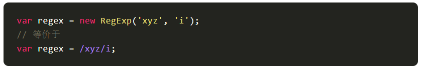
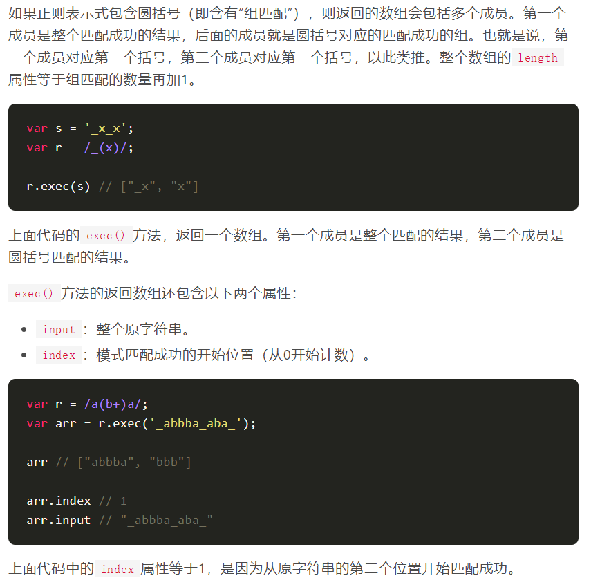
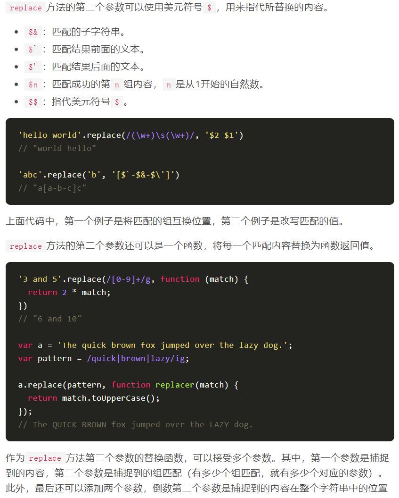

# 正则表达式

[正则表达式](https://juejin.cn/post/6844903845227659271)

- RegExp对象
   - 新建正则表达式有两种方法。一种是使用字面量，以斜杠表示开始和结束。另一种是使用RegExp构造函数。
   - 实例属性
      - 修饰符相关（只读）
         - RegExp.prototype.ignoreCase：返回一个布尔值，表示是否设置了i修饰符。
         - RegExp.prototype.global：返回一个布尔值，表示是否设置了g修饰符。
         - RegExp.prototype.multiline：返回一个布尔值，表示是否设置了m修饰符。
         - RegExp.prototype.flags：返回一个字符串，包含了已经设置的所有修饰符，按字母排序。
      - 修饰符无关
         - RegExp.prototype.lastIndex：返回一个整数，表示下一次开始搜索的位置。该属性可读写，但是只在进行连续搜索时有意义，详细介绍请看后文。
         - RegExp.prototype.source：返回正则表达式的字符串形式（不包括反斜杠），该属性只读。
   - 实例方法（lastIndex 生效）
      - RegExp.prototype.test()方法返回一个布尔值，表示当前模式是否能匹配参数字符串。
         - 带有g修饰符时，正则表达式内部会记住上一次的lastIndex属性，这时不应该更换所要匹配的字符串，否则会有一些难以察觉的错误。
      - RegExp.prototype.exec() 方法，用来返回匹配结果。如果发现匹配，就返回一个数组，成员是匹配成功的子字符串，否则返回null。
   - 字符串的实例方法
      - String.prototype.match()：返回一个数组，成员是所有匹配的子字符串。
         - 字符串的match方法与正则对象的exec方法非常类似：匹配成功返回一个数组，匹配失败返回null。
         - 如果正则表达式带有g修饰符，则该方法与正则对象的exec方法行为不同，会一次性返回所有匹配成功的结果。
         - 且设置正则表达式的lastIndex属性，对match方法无效，匹配总是从字符串的第一个字符开始。
      - String.prototype.search()：按照给定的正则表达式进行搜索，返回一个整数，表示匹配开始的位置。
      - String.prototype.replace()：按照给定的正则表达式进行替换，返回替换后的字符串。
         - 正则表达式如果不加g修饰符，就替换第一个匹配成功的值，否则替换所有匹配成功的值。
         - 
      - String.prototype.split()：按照给定规则进行字符串分割，返回一个数组，包含分割后的各个成员。
   - 贪婪模式（?）
      - +?：表示某个模式出现1次或多次，匹配时采用非贪婪模式。
      - *?：表示某个模式出现0次或多次，匹配时采用非贪婪模式。
      - ??：表格某个模式出现0次或1次，匹配时采用非贪婪模式。
   - 组匹配
      - ()且还可以用\n引用括号匹配的内容，n是从1开始的自然数，表示对应顺序的括号。
      - ?:称为非捕获组（Non-capturing group），表示不返回该组匹配的内容，即匹配的结果中不计入这个括号。
      - x(?=y)称为先行断言（Positive look-ahead），x只有在y前面才匹配，y不会被计入返回结果。
      - x(?!y)称为先行否定断言（Negative look-ahead），x只有不在y前面才匹配，y不会被计入返回结果。
